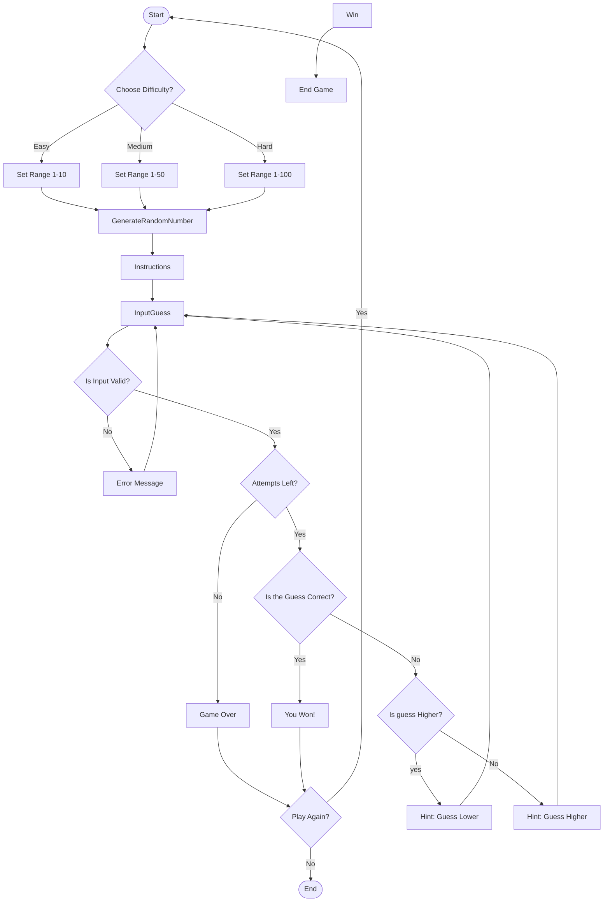

# **Documentation/Descriptions** 
#### **Start:** Begins the game.
#### ** Choose Difficulty: ** The user selects a difficulty level, setting the set range of numbers. 
#### **Generate Random Number:** The system picks a number within the set range.
#### **Display Instructions:** The user sees game instructions.
#### **Prompt User for Guess:** The user inputs a guess.
#### **Validate Input:** Checks if the input is valid.
##### **_Invalid Input:_** Displays an error message and prompts again.
#### **Check Attempts:** Verifies if there are attempts left.
##### **_No Attempts:_** Displays Game over message and option to play again.
##### **_Attempts Left:_** Checks the guess.
#### **Check Guess:** Determines if the guess is correct.
##### **_Correct:_** Displays a winning message and offers to play again.
##### **_Incorrect:_** Checks if the guess is higher or lower and provides hints.
#### **Play Again:** Decision point for restarting the game or ending it.
